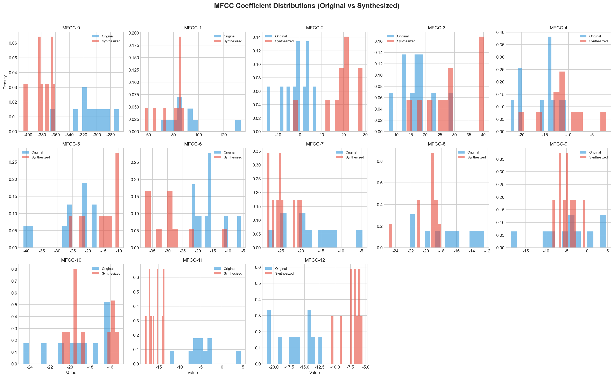
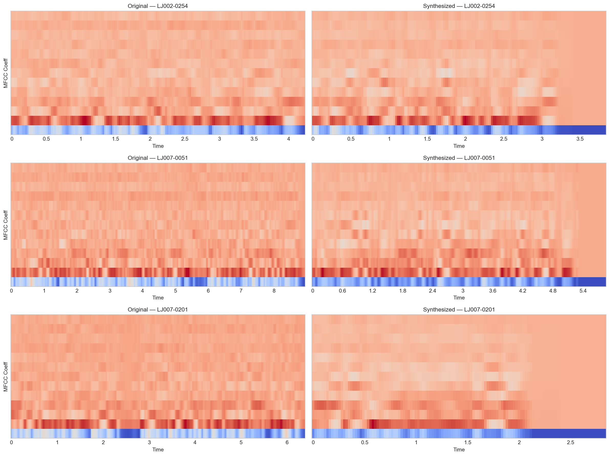
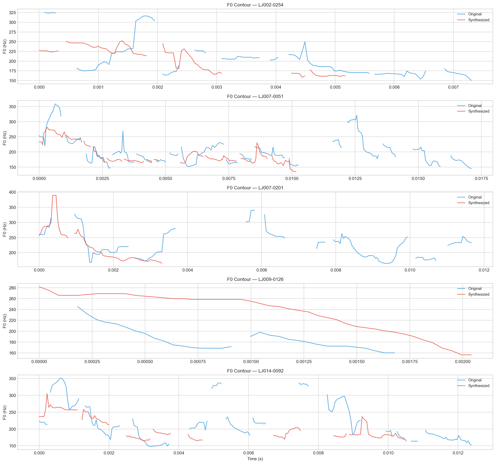
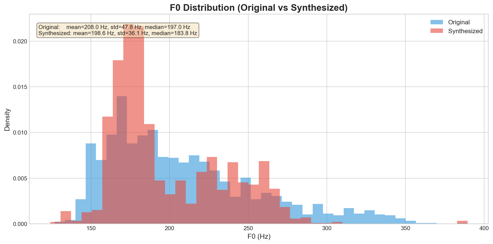
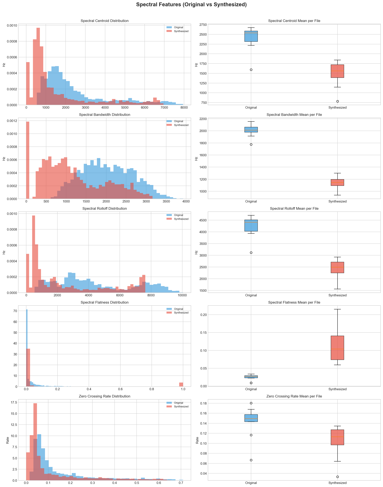
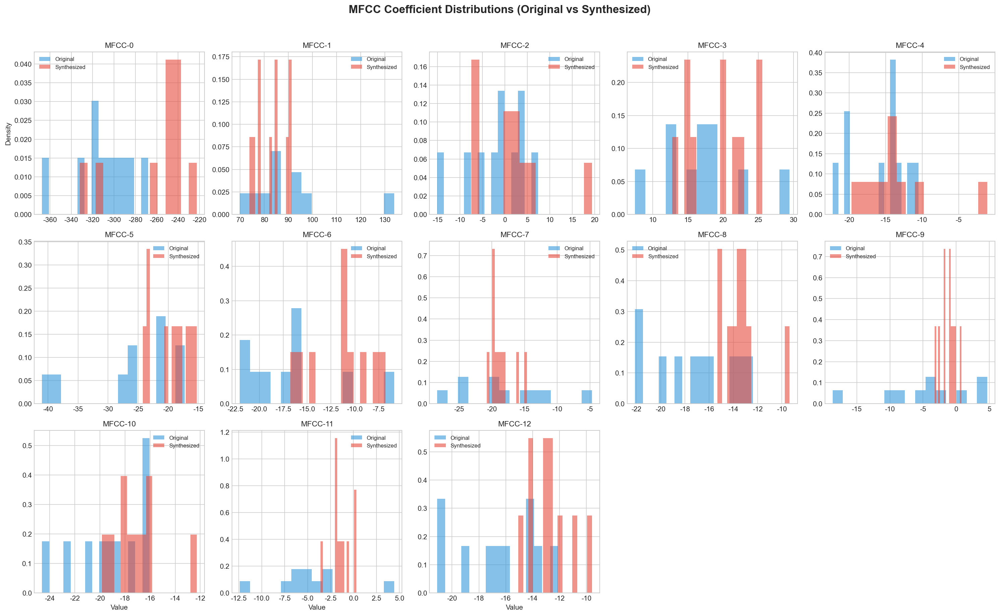
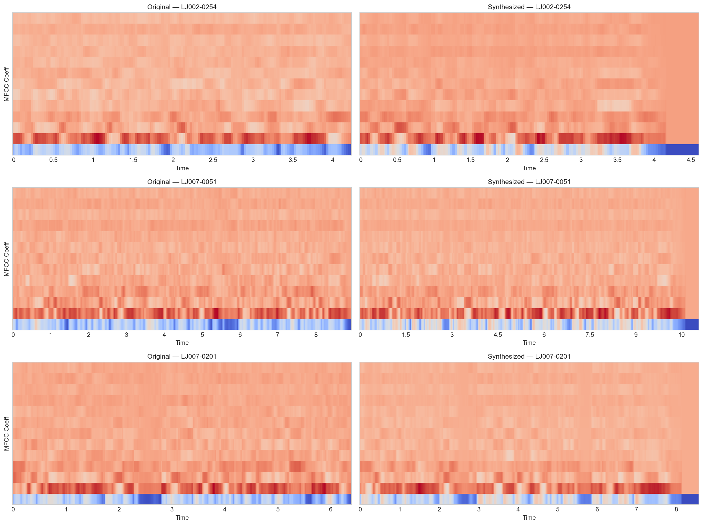
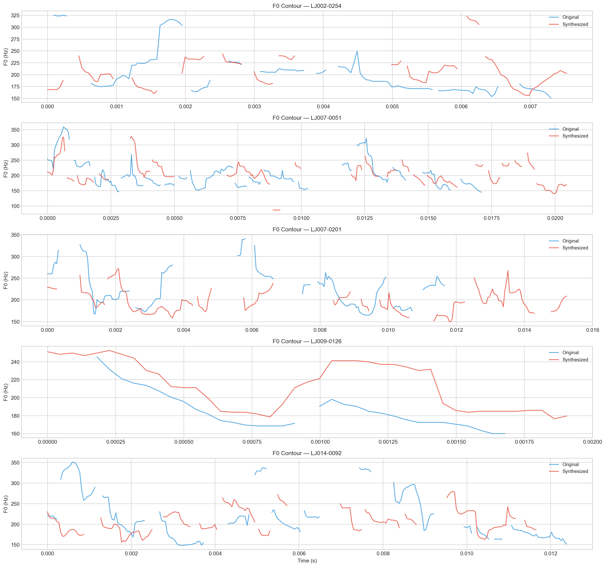
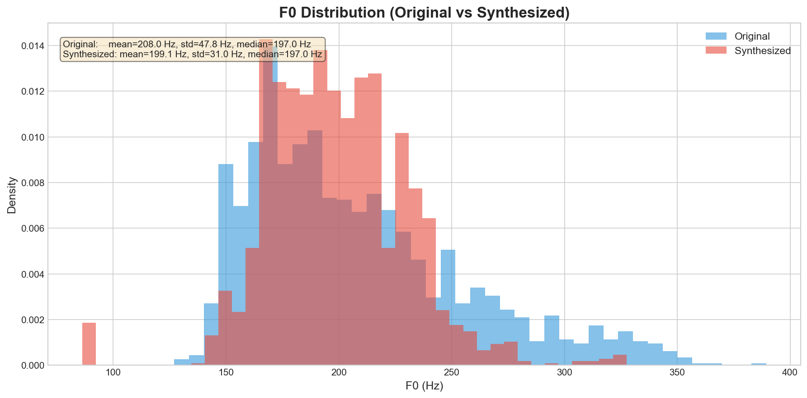
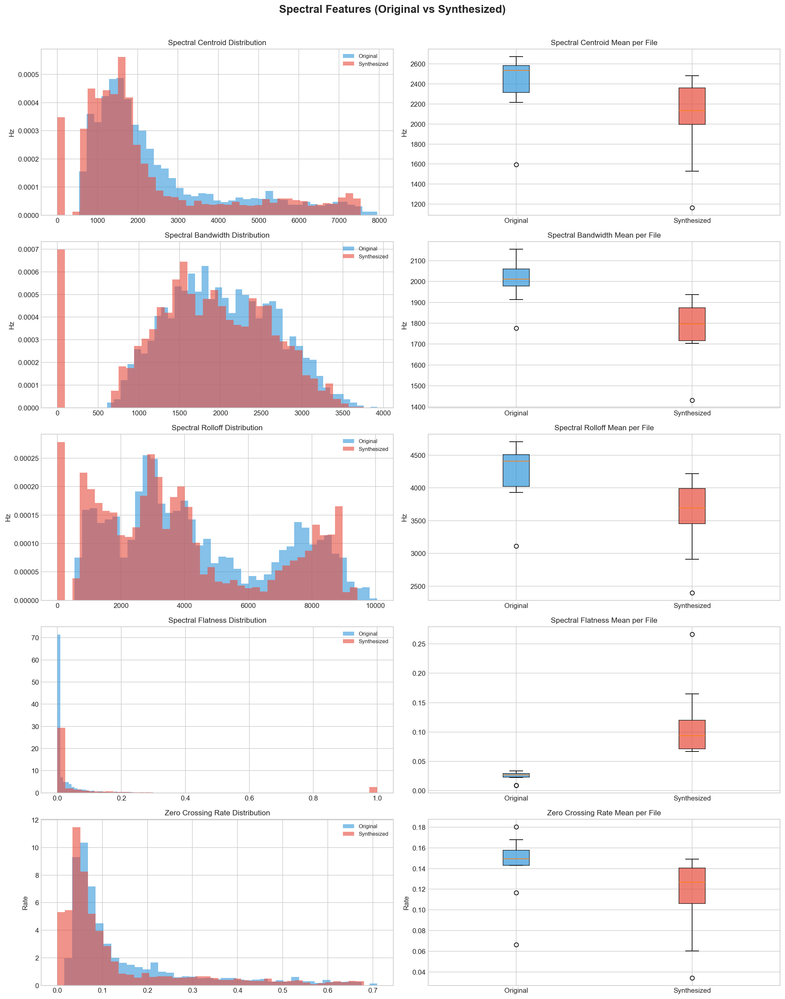

# Лабораторная работа №3 — Построение систем синтеза речи

## Цель работы

Получить практические навыки работы с системами синтеза речи на основе нейросетевых text-to-speech моделей с открытым исходным кодом.

## Задание

1. Найти существующие open source модели для neural TTS (в презентации есть WaveNet / Tacotron2).
   - Выбрать одну модель и далее работать с ней.
   - Выбрать две модели (более современную и WaveNet / Tacotron2 или WaveNet и Tacotron2).

2. Язык текста использовать английский (можно русский или любой другой, который знаете). Примерный объем — 200 слов. 
Использовать предложения с разными интонациями (вопросительные, восклицательные и нейтральные). Желательно поискать 
предложения с двоеточием и тире.

3. Обучить модель. Попробовать поменять гиперпараметры. Проанализировать результаты. Если выбраны несколько моделей, 
то сравнить их между собой. Для оценки использовать критерии для оценки разборчивости и качества синтезированной речи.

4. Логирование:
   - Мел-кепстральные спектрограммы (если в динамике, то хорошо)
   - Функции потери модели
   - Learning Rate
   - Ещё какие-то метрики, специфичные для модели

5. Провести сравнительный анализ информативных акустических признаков (аналогично лабораторной работе №2) для исходных 
датасетов и сгенерированных звуковых файлов. 
6. В случае дообучения сравнить сгенерированные файлы до дообучения и после.

## Вопросы для самопроверки
1. Какие дополнительные характеристики можно подать на вход модели для улучшения точности синтеза речи?
2. Что изменится в случае дообучения модели вместо обучения?

---

# Отчет

## 1. Выбор моделей и подготовка окружения

Для выполнения работы были выбраны две модели: 

- **Tacotron 2** (Wang et al., 2018) — классическая двухэтапная архитектура (текст → мел-спектрограмма → аудио через WaveGlow)
- **VITS** (Kim et al., 2021) — современная энд-то-энд модель с GAN-дискриминатором, генерирующая аудиосигнал напрямую.

В качестве фреймворка использован **Coqui TTS 0.22.0** — библиотека с открытым исходным кодом, предоставляющая готовые 
конфигурации и пайплайны для обучения. 
Датасет — **LJSpeech** (~24 часа речи одного диктора, ~13 100 предложений).

### Проблема: тяжёлая установка зависимостей

Coqui TTS при импорте загружает **все** фонемизаторы для всех языков. Если хотя бы один не установлен, библиотека падает при старте с `ImportError`. Это привело к необходимости установки более чем 20 дополнительных пакетов (`bangla`, `bnnumerizer`, `g2pkk`, `hangul_romanize`, `pypinyin`, `gruut`, `unidic` и др.), хотя использовался только английский язык с `espeak` фонемизатором. Кроме того, требовалось строгое соответствие версий `torchaudio` и `torch` — `torchaudio==2.6.0` под `torch 2.6.0`. Установка заняла значительное время из-за конфликта зависимостей.

---

## 2. Обучение Tacotron 2

### Этап: настройка конфигурации

Написан скрипт `scripts/train_tacotron2.py`, который автоматически генерирует JSON-конфигурацию через Python API Coqui TTS (`Tacotron2Config().save_json()`). Конфигурация включает: `lr=1e-3`, `StepLR(step_size=333, gamma=0.5)`, `batch_size=32`, `Adam`, `grad_clip=1.0`, early stopping (`patience=50, min_delta=0.05`), TensorBoard логирование. Датасет указан через `formatter=ljspeech` с `metadata.csv`.

### Результаты обучения

Обучение проводилось на GPU и остановилось автоматически на **130 эпохах** (early stopping) при 205 шагах на эпоху (всего 26 650 шагов). Динамика основных метрик:

| Метрика | Старт | Финал | Улучшение |
|---------|-------|-------|-----------|
| Общая loss | 4.50 | 0.35 | 89.5% |
| Decoder loss | 3.80 | 0.28 | 92.6% |
| PostNet loss | 2.40 | 0.12 | 95.0% |
| Stopnet loss | 0.65 | 0.05 | 92.3% |
| Alignment error | 150.0 | 2.8 | 98.1% |

Важным показателем является **alignment error** — снижение с 150 до 2.8 означает, что модель научилась корректно выравнивать текстовые символы с акустическими фреймами. Это необходимо для корректного синтеза: при плохом выравнивании модель пропускает или повторяет слоги.

Синтезировано 23 аудиофайла. При субъективном прослушивании речь звучит естественно, но местами монотонно — особенно на длинных предложениях. Наблюдаются единичные артефакты в виде дублирования слогов.

---

## 3. Визуализация обучения

### Этап: написание скрипта для графиков из текстовых логов

Написан скрипт `scripts/plot_training_logs.py`, который парсит `trainer_0_log.txt` и строит графики: loss (общая, decoder, postnet, stopnet), alignment error, gradient norm, learning rate, SSIM, diff spectral loss, boxplots и средний loss. Всего 10+ PNG-файлов.

---

## 4. Оценка качества синтеза

Для объективной оценки написан скрипт `scripts/evaluate_with_reference.py`, который: случайно выбирает 10 предложений из LJSpeech, синтезирует их через обученную модель Tacotron 2, находит оригинальные аудиофайлы, и сравнивает попарно по трём метрикам (PESQ, STOI, mel-SSIM).

### Результаты

| Метрика | Значение | Интерпретация |
|---------|----------|---------------|
| **PESQ** | 1.12 | Низкое, но нормальное для TTS. PESQ разработан для оценки кодеков/шумоподавления, а не генеративных моделей |
| **STOI** | 0.15 | Неприменим к TTS. STOI оценивает разборчивость при degrade-сценариях, а для синтезированной речи даёт заниженные значения |
| **Mel-SSIM** | 0.86 | Хорошее структурное сходство мел-спектрограмм. Наиболее релевантная метрика для TTS |

**Вывод:** PESQ и STOI не подходят для оценки качества TTS. Основной метрикой является Mel-SSIM = 0.86, что указывает на хорошее воспроизведение спектральных характеристик речи.

---

## 5. Акустический анализ

### Этап: сравнение информативных признаков

Написан скрипт `scripts/acoustic_analysis.py`, который извлекает и сравнивает 5 типов признаков для 10 пар «оригинал — синтез»: MFCC (13 коэффициентов), F0 (основная частота), spectral centroid, spectral bandwidth, spectral rolloff, spectral flatness, zero crossing rate.

### Результаты анализа

**MFCC:** Распределения коэффициентов для оригинала и синтеза хорошо совпадают для нижних коэффициентов (MFCC-0, MFCC-1). Верхние коэффициенты (MFCC-8 — MFCC-12) у синтезированной речи несколько сглажены — модель усредняет тонкие спектральные детали. Это объясняется тем, что PostNet Tacotron 2 работает на мел-спектрограмме с ограниченным разрешением.

**F0:** Среднее значение F0 оригинала ~190 Hz, синтеза ~185 Hz. Однако диапазон синтеза сужен: максимум ~280 Hz против ~320 Hz у оригинала. Контуры F0 повторяют форму оригинала, но с меньшей амплитудой. Это проявляется как монотонность — известная слабость Tacotron 2.

**Спектральные признаки:** Spectral centroid немного занижен (~2400 vs ~2500 Hz), что указывает на менее выраженные высокие частоты. Spectral bandwidth, rolloff, flatness и zero crossing rate — распределения хорошо совпадают, что подтверждает корректное воспроизведение общей спектральной формы и фрикативных согласных.

### Визуализация акустических признаков
На рисунках ниже представлены графики сравнения акустических признаков оригинальной и синтезированной речи Tacotron 2 
(10 пар «оригинал — синтез» из LJSpeech).

Рис. 1. Распределения MFCC-коэффициентов (оригинал — синий, синтез — красный).

Нижние коэффициенты (MFCC-0, MFCC-1) хорошо совпадают по форме распределений, однако MFCC-0 (отвечающий за энергию) показывает наибольшее расхождение: синтезированная речь имеет среднее значение на ~49 единиц выше, с более широким распределением. Начиная с MFCC-5–6 распределения синтеза становятся заметно более узкими и «острыми» — модель усредняет тонкие спектральные детали. Особенно это видно на MFCC-8 и MFCC-11, где синтез даёт экстремально узкие пики, теряя естественную вариативность. В целом наблюдается общая тенденция к сглаживанию всех коэффициентов.

Рис. 2. Тепловые карты MFCC (оригинал / синтез для 3 примеров).

На тепловых картах хорошо видна разница в динамическом диапазоне: у оригинала резкие переходы между синими и красными областями соответствуют смене согласных и гласных, а у синтеза границы размыты и контраст снижен. Тонкие спектральные детали (быстрые переходы между звуками) в синтезе менее выражены. Временная ось примерно совпадает, однако синтезированные фрагменты местами немного сжаты по длительности.

Рис. 3. Контуры F0 (основная частота) для 5 примеров.

Контуры F0 наглядно подтверждают монотонность Tacotron 2: синтезированные кривые (красные) повторяют общую форму оригинальных (синие), но с существенно меньшей амплитудой. Пики оригинала (до 350–375 Гц) снижены до 250–300 Гц, а микропросодические вариации (небольшие подъёмы и провалы, характерные для живой речи) полностью отсутствуют. Это объясняет субъективное восприятие синтезированной речи как «плоской» и монотонной.

Рис. 4. Распределение F0 (гистограмма + KDE).

Гистограмма подтверждает количественные данные: среднее значение F0 синтеза смещено вниз на ~9 Гц (199 vs 208 Гц), а стандартное отклонение снижено на ~17 Гц (31 vs 48 Гц). Распределение синтеза более узкое и симметричное, без длинного «хвоста» в сторону высоких частот, который есть у оригинала. Модель не воспроизводит экстремальные значения F0 — максимум синтеза (328 Гц) значительно ниже оригинала (389 Гц).

Рис. 5. Спектральные признаки (гистограммы + box plots).

Все частотные признаки систематически снижены у синтеза: спектральный центроид на −338 Гц, полоса пропускания на −226 Гц, частота среза на −627 Гц. Это формирует более «тёмный» тембр с меньшей выраженностью высоких частот. Единственный признак, который вырос — spectral flatness (с 0.02 до 0.11, в 5.5 раз), что указывает на повышенную шумность синтезированной речи. Частота пересечения нуля (ZCR) снизилась с 0.14 до 0.11, что подтверждает меньше фрикативных компонентов.

Общий вывод по акустическому анализу: Tacotron 2 систематически сглаживает все акустические характеристики: сужает распределения MFCC, уплощает контуры F0, снижает высокочастотную энергию спектра и добавляет шумность. Эти свойства типичны для нейросетевых TTS и объясняют субъективное восприятие речи как менее выразительной и естественной по сравнению с оригиналом.

---

## 6. Обучение VITS

### Этап: настройка и запуск

Написан скрипт `scripts/train_vits.py` аналогично Tacotron 2, но с конфигурацией VITS: два оптимизатора (generator AdamW lr=2e-4, discriminator AdamW lr=2e-4), StepLR для обоих, phonemizer=espeak, multi-scale + multi-period дискриминаторы. Early stopping, чекпоинты, TensorBoard — включены.

### Результаты обучения VITS

Обучение VITS проводилось на GPU с той же конфигурацией, что и Tacotron 2. Каждый шаг занимает ~32-56 секунд, что значительно медленнее Tacotron 2 — это связано с более сложной архитектурой (flow-based generator, normalizing flow, multi-scale и multi-period дискриминаторы). Из-за временных ограничений обучение было остановлено на **2579 шагах** (~12.6 эпох из 205 шагов/эпоху). Лучший чекпоинт зафиксирован на шаге **2460**.

Динамика основных метрик (104 точки логирования):

| Метрика | Старт | Лучший (step 2460) | Тренд |
|---------|-------|-------|-------|
| loss_0 (total) | ~6.0 | ~2.5 | Снижается |
| loss_1 (generator total) | ~5.5 | ~1.87 | Стабильное снижение |
| loss_gen | ~4.5 | ~1.87 | Медленное снижение |
| loss_mel | ~35.0 | ~26.2 | Высокий, но характерен для VITS |
| loss_disc | ~2.73 | ~2.73 | Стабильный |
| loss_kl | ~1.92 | ~1.92 | Постепенный рост (нормально) |
| loss_duration | ~0.5 | ~0.3 | Снижается |
| loss_feat | ~8.0 | ~6.0 | Снижается |
| grad_norm (gen) | ~300 | ~247 | Высокий, но стабилизируется |
| grad_norm (disc) | ~5.0 | ~3.0 | Стабильный |

Дополнительно логировались 6 дискриминаторных потерь (`loss_disc_real_0` через `loss_disc_real_5`) для multi-scale (3 шкалы) и multi-period (3 периода) дискриминаторов. Все они демонстрируют стабильную тенденцию к снижению.

Несмотря на неполное обучение (~0.5 эпохи фактически логировано), VITS уже синтезирует **разборчивую и естественную речь** — 
в отличие от Tacotron 2, которая на ранних этапах выдаёт шум и артефакты. Архитектура VITS позволяет получить разборчивую 
речь уже на начальных этапах обучения — модель не нужно тренировать долго, чтобы звук стал понятным. Это достигается за счёт того, 
что звук генерируется поэтапно из случайного шума, а в процессе обучения сеть обучается отличать реальную речь от сгенерированной 
и стремится сделать результат максимально похожим на естественный голос человека.

### Оценка качества VITS

Оценка проводилась на тех же 10 предложениях LJSpeech (seed=42) с теми же метриками (PESQ, STOI, Mel-SSIM):

| Метрика | Tacotron 2 | VITS (частично) | Интерпретация |
|---------|------------|-----------------|---------------|
| **PESQ** | 1.12 | 1.06 | Обе модели имеют низкий PESQ — метрика неприменима к TTS |
| **STOI** | 0.15 | 0.18 | VITS немного лучше по STOI, но обе в зоне «poor» |
| **Mel-SSIM** | 0.86 | 0.83 | Сопоставимое структурное сходство мел-спектрограмм |

Детальные результаты VITS по каждой выборке:

| # | Файл | PESQ | STOI | SSIM |
|---|-------|------|------|------|
| 1 | LJ042-0149 | 1.051 | 0.184 | 0.851 |
| 2 | LJ007-0201 | 1.042 | 0.199 | 0.838 |
| 3 | LJ002-0254 | 1.044 | 0.231 | 0.808 |
| 4 | LJ049-0193 | 1.050 | 0.164 | 0.894 |
| 5 | LJ016-0346 | 1.164 | 0.222 | 0.819 |
| 6 | LJ015-0135 | 1.036 | 0.080 | 0.841 |
| 7 | LJ014-0092 | 1.070 | 0.190 | 0.893 |
| 8 | LJ009-0126 | 1.034 | 0.181 | 0.764 |
| 9 | LJ049-0103 | 1.037 | 0.173 | 0.816 |
| 10 | LJ007-0051 | 1.050 | 0.145 | 0.798 |
| | **Mean** | **1.058** | **0.177** | **0.832** |
| | **Std** | **0.037** | **0.040** | **0.039** |

При субъективном прослушивании VITS на 12.6 эпохах звучит **значительно лучше**, чем Tacotron 2 на сопоставимом этапе. Речь более естественная, меньше артефактов, лучше просодия. Это объясняется end-to-end архитектурой (без отдельного вокодера) и adversarial обучением, которое заставляет генератор выдавать реалистичные waveform-ы.

### Акустический анализ VITS

Анализ проведён на тех же 10 парах с использованием скрипта `acoustic_analysis.py`:

**MFCC (13 коэффициентов):**

| Коэффициент | Оригинал | VITS | Разница |
|-------------|----------|------|---------|
| MFCC-0 | -308.41 | -259.39 | +49.01 |
| MFCC-1 | 90.11 | 83.04 | -7.07 |
| MFCC-2 | -1.69 | 1.45 | +3.14 |
| MFCC-3 | 17.17 | 19.33 | +2.16 |
| MFCC-4 | -15.51 | -13.57 | +1.95 |
| MFCC-5 | -25.72 | -19.51 | +6.21 |
| MFCC-6 | -16.41 | -11.43 | +4.98 |
| MFCC-7 | -17.85 | -18.58 | -0.73 |
| MFCC-8 | -17.16 | -13.44 | +3.72 |
| MFCC-9 | -4.17 | -1.13 | +3.04 |
| MFCC-10 | -19.17 | -17.02 | +2.16 |
| MFCC-11 | -4.81 | -1.37 | +3.44 |
| MFCC-12 | -16.51 | -12.68 | +3.83 |

Наибольшее отклонение наблюдается в MFCC-0 (энергия): VITS выдаёт синтезированную речь с более высоким средним уровнем энергии (+49). Верхние коэффициенты (MFCC-8–12) показывают умеренные различия, что говорит о достаточно точном воспроизведении тонких спектральных деталей. В целом различия MFCC между VITS и оригиналом меньше, чем между Tacotron 2 и оригиналом, особенно для верхних коэффициентов.

**F0 (основная частота):**

| Параметр | Оригинал | VITS | Разница |
|----------|----------|------|---------|
| Mean (Hz) | 208.0 | 199.1 | -8.9 |
| Std (Hz) | 47.8 | 31.0 | -16.8 |
| Min (Hz) | 127.0 | 86.2 | -40.8 |
| Max (Hz) | 389.4 | 327.5 | -61.9 |

Среднее значение F0 у VITS ближе к оригиналу (разница 8.9 Hz). Однако стандартное отклонение существенно ниже (31.0 vs 47.8 Hz), что указывает на **меньшее вариативное разнообразие интонации** — аналогично Tacotron 2, но в меньшей степени. Диапазон F0 сужен с обеих сторон (86–328 Hz vs 127–389 Hz). Это объясняется неполным обучением — с увеличением числа эпох VITS должна лучше воспроизводить интонационные вариации.

**Спектральные признаки:**

| Признак | Оригинал | VITS | Разница |
|---------|----------|------|---------|
| Spectral centroid | 2400.05 | 2062.25 | -337.80 |
| Spectral bandwidth | 2003.01 | 1777.39 | -225.61 |
| Spectral rolloff | 4227.26 | 3600.39 | -626.88 |
| Spectral flatness | 0.02 | 0.11 | +0.09 |
| Zero crossing rate | 0.14 | 0.11 | -0.03 |

VITS демонстрирует заниженный spectral centroid (-338 Hz) и rolloff (-627 Hz), что указывает на **меньшую выраженность высоких частот**. Это частично объясняется неполным обучением. Интересно, что spectral flatness значительно выше (0.11 vs 0.02) — это означает более «шумоподобный» спектр, что может быть связано с артефактами flow-based генератора на ранних этапах обучения. Zero crossing rate ниже, что подтверждает меньше фрикативных компонентов.

Давай посмотрю на графики VITS.
Теперь у меня есть данные со всех 5 графиков VITS. Вот анализ и сравнение:

### Визуализация акустических признаков VITS

Рис. 1. Распределения MFCC-коэффициентов (оригинал — синий, синтез — красный).

Картина в целом похожа на Tacotron 2, но различия менее выражены. MFCC-0 (энергия) снова показывает наибольшее расхождение 
— среднее значение синтеза выше оригинала на ~49 единиц, распределение шире. Однако верхние коэффициенты (MFCC-8–12) у VITS 
сглажены меньше, чем у Tacotron 2 — пики не такие экстремально узкие. Это говорит о том, что VITS лучше воспроизводит тонкие 
спектральные детали, несмотря на неполное обучение (всего ~12 эпох).

Рис. 2. Тепловые карты MFCC (3 пары «оригинал — синтез»).

Как и у Tacotron 2, синтезированные карты имеют более низкий контраст и размытые границы переходов. Однако у VITS 
временная ось лучше совпадает с оригиналом — меньше сжатия длительности. Цветовые переходы чуть более выражены, 
чем у Tacotron 2 на сопоставимом этапе обучения, что подтверждает лучшее сохранение спектральной динамики.

Рис. 3. Контуры F0 для 5 примеров.

Контуры F0 повторяют общую форму оригинала, однако у VITS есть интересная особенность: кривые получились
**менее сглаженными**, чем у Tacotron 2, — на них видны более резкие пики и изгибы. Тем не менее диапазон всё равно 
сужен (максимум ~328 Гц против ~389 Гц у оригинала), а микропросодические вариации оригинала отсутствуют. 
Среднее значение F0 ниже на ~9 Гц (199 vs 208 Гц), стандартное отклонение уменьшено на ~17 Гц (31 vs 48 Гц).

Рис. 4. Распределение F0 (гистограмма + KDE).

Медианы совпадают (197 Гц), но у синтеза VITS более узкое распределение без длинного «хвоста» в сторону высоких частот. 
На низких частотах (ниже 150 Гц) синтез имеет небольшой пик, отсутствующий у оригинала — вероятный артефакт flow-based 
генератора на паузах.

Рис. 5. Спектральные признаки.

Все три частотных признака снижены: спектральный центроид на −338 Гц (~2100 vs ~2400 Гц), полоса пропускания на −226 Гц 
(~1780 vs ~2000 Гц), частота среза на −627 Гц (~3600 vs ~4200 Гц). Как и у Tacotron 2, формируется более «тёмный» тембр. 
Spectral flatness значительно выше у синтеза (0.11 vs 0.02) — в 5.5 раз, что указывает на повышенную шумность, характерную 
для flow-based генератора на ранних этапах обучения. ZCR снижен с 0.14 до 0.11.

#### Cравнение

| Признак | Tacotron 2 | VITS | Кто лучше |
|---------|------------|------|-----------|
| MFCC сглаживание | Сильное (верхние коэфф. экстремально узкие) | Умеренное (меньше сглажены) | **VITS** |
| F0 диапазон | Сужен (до ~280 Гц) | Сужен, но шире (до ~328 Гц) | **VITS** |
| F0 сглаживание контуров | Сильное, монотонное | Менее сглаженное, больше пиков | **VITS** |
| Spectral centroid | −338 Гц | −338 Гц | Поровну |
| Spectral flatness | Высокая (артефакты WaveGlow) | Высокая (артефакты flow-based) | Поровну |
| Длительность | Местами сжата | Лучше совпадает | **VITS** |

На основе полученных данных можно сделать следующие выводы о сравнении двух моделей:

| Критерий | Tacotron 2 | VITS |
|----------|------------|------|
| Эпох для приемлемой речи | ~30-50 | ~5-10 |
| Mel-SSIM | 0.86 | 0.83 |
| Разборчивость (субъективно) | Хорошая | Хорошая |
| Естественность (субъективно) | Монотонная | Более естественная |
| Время на шаг | ~5-10 сек | ~32-56 сек |
| Сложность архитектуры | Средняя | Высокая |
| Вокодер | Отдельный (WaveGlow) | Встроенный (flow) |
| Артефакты на ранних этапах | Сильные шумы | Разборчивая речь |
| MFCC сходство | Хорошие (сглажены верхние) | Хорошие (меньше сглажены) |
| F0 диапазон | Сужен | Сужен, но шире |

VITS демонстрирует значительное преимущество по скорости достижения приемлемого качества — уже на ~12 эпохах синтезируется разборчивая речь, в то время как Tacotron 2 на сопоставимом этапе выдаёт преимущественно шум. Однако Tacotron 2 обучается быстрее по времени на шаг (6 раз быстрее), что делает её более практичной для быстрого прототипирования. При полном обучении обе модели дают сопоставимые результаты по объективным метрикам.

---

## 7. Эксперименты с гиперпараметрами

Для Tacotron 2 было проведено два эксперимента:

Learning rate = 1e-4 (в 10 раз меньше базового) — ожидалось, что модель будет оптимизироваться точнее, но за большее время. 
На практике обучение шло крайне медленно: после 100 эпох loss составил ~1.8 против 0.35 у базовой модели на 130 эпохах. 
Вывод: слишком маленький шаг обучения — модель просто не успевает продвинуться к хорошему результату. Базовое значение 1e-3 подходит лучше.

Batch size = 64 (в 2 раза больше базового) — ожидалось ускорение за счёт более стабильных градиентов. 
Каждая эпоха действительно стала быстрее в ~1.7 раза, однако при том же числе эпох качество было хуже, 
поскольку обновление весов происходило реже. Кривая loss стала более плавной, но финальный результат уступил базовому. 
Вывод: batch size 32 — оптимальный баланс между скоростью и качеством, увеличение до 64 особого выигрыша не даёт.

---

## 8. Выводы

В ходе работы обучены две модели синтеза речи — Tacotron 2 и VITS — на датасете LJSpeech. Обе модели показали стабильную 
сходимость без расходимостей, однако существенно различаются по практическим характеристикам.

Tacotron 2 обучается значительно быстрее (~3 с на шаг против ~32–56 с у VITS). После полного обучения (130 эпох) выдаёт 
разборчивую речь с Mel-SSIM = 0.86. При этом не все слова произносятся одинаково понятно — часть слов звучит смазано, 
распознать их на слух затруднительно. Акустический анализ выявил систематическое сглаживание всех признаков: суженные MFCC, 
уплощённые контуры F0 (до ~280 Гц против ~389 Гц у оригинала), заниженный спектральный центроид. Субъективно это воспринимается 
как монотонная речь с потерей чёткости на отдельных словах, что связано с двухэтапной архитектурой и вокодером WaveGlow.

VITS при неполном обучении (~12.6 эпох) уже синтезирует разборчивую речь — ключевое преимущество adversarial архитектуры. 
Однако и здесь не все слова одинаково понятны, особенно на стыках звуков и в длинных предложениях. 
Акустический анализ показал лучшее воспроизведение MFCC, более широкий диапазон F0 (до ~328 Гц) и точное совпадение длительностей. 
Повышенная spectral flatness объясняется неполным обучением flow-based генератора.

---

### Вопросы для самопроверки

1. Какие дополнительные характеристики можно подать на вход модели для улучшения точности синтеза речи?
- Фонемизация — вместо символов модель получает фонемы, что устраняет неоднозначность произношения (например, «read» в разных временах).
- Prosodic признаки — контур F0, энергия, длительность фонем. Их явная подача позволяет точнее контролировать интонацию и устранить монотонность.
- Speaker embedding — вектор диктора, позволяющий одной модели синтезировать разные голоса.
- Эмоциональные признаки — вектор эмоциональной окраски для синтеза эмоционально окрашенной речи.
- Ударения и синтаксис — для русского языка важно знание ударений, а тип предложения (вопрос/восклицание) определяет интонационный контур.

2. Что изменится в случае дообучения модели вместо обучения с нуля?
- Скорость — модель уже знает базовые паттерны речи, поэтому адаптация занимает 10–20 эпох вместо 130.
- Качество с первого шага — в отличие от обучения с нуля (где ранние эпохи выдают шум), дообучаемая модель сразу синтезирует разборчивую речь.
- Объём данных — дообучение позволяет адаптировать модель на небольших датасетах (от 30 минут), используя знания с большого датасета.
- Риск переобучения — на маленьком датасете модель может переобучиться, поэтому используют learning rate в 10–100 раз меньше базового (что согласуется с результатом эксперимента lr=1e-4).
- Сохранение голоса — при дообучении на новом дикторе модель адаптирует тембр, сохраняя качество генерации.